# Guía del Sistema de Chat en Tiempo Real - Soporte

## Descripción General
Esta guía cubre la implementación completa del sistema de chat en tiempo real para soporte, incluyendo WebSockets, manejo de archivos, historial persistente y componentes React reutilizables.

## 1. ARQUITECTURA DEL SISTEMA

### 1.1 Flujo de Conexión WebSocket

```mermaid
sequenceDiagram
    participant Cliente as Cliente Frontend
    participant WS as WebSocket Server
    participant Redis as Redis Cache
    participant DB as Base de Datos
    
    Cliente->>WS: Conectar con token JWT
    WS->>WS: Validar token
    WS->>Redis: Registrar conexión activa
    WS->>Cliente: Confirmar conexión
    WS->>Redis: Obtener historial reciente
    WS->>Cliente: Enviar historial reciente
    
    Cliente->>WS: Enviar mensaje
    WS->>DB: Guardar mensaje
    WS->>Redis: Cache mensaje
    WS->>Cliente: Confirmar recepción
    WS->>WS: Broadcast a agentes
```


### 1.2 Estructura de Datos en Tiempo Real
```javascript
// Estructura del estado global del chat
const chatState = {
  // Conexión WebSocket
  connection: {
    status: 'connected', // 'connecting', 'connected', 'disconnected', 'reconnecting'
    socket: WebSocketInstance,
    lastPing: timestamp,
    reconnectAttempts: 0,
    maxReconnectAttempts: 5
  },
  
  // Datos del chat actual
  currentChat: {
    ticketId: 456,
    chatId: 'chat_456_abc123',
    participants: [
      {
        id: 1,
        nombre: 'Juan Pérez',
        tipo: 'CLIENTE',
        avatar: null,
        online: true,
        lastSeen: timestamp
      },
      {
        id: 5,
        nombre: 'María Rodríguez',
        tipo: 'AGENTE',
        avatar: 'avatar_url',
        online: true,
        lastSeen: timestamp
      }
    ]
  },
  
  // Mensajes del chat
  messages: [
    {
      id: 'msg_001',
      timestamp: '2024-09-20T17:30:00Z',
      autor: {
        id: 5,
        nombre: 'María Rodríguez',
        tipo: 'AGENTE'
      },
      contenido: 'Hola, ¿en qué puedo ayudarte?',
      tipo: 'TEXTO',
      estado: 'ENTREGADO', // 'ENVIANDO', 'ENTREGADO', 'LEIDO', 'ERROR'
      archivos: [],
      replyTo: null,
      editado: false,
      eliminado: false
    }
  ],
  
  // Estado de escritura
  typing: {
    usuarios: [], // IDs de usuarios que están escribiendo
    timeout: null
  },
  
  // Configuración
  config: {
    maxFileSize: 10485760, // 10MB
    allowedFileTypes: ['jpg', 'png', 'pdf', 'doc', 'docx'],
    typingTimeout: 3000,
    messageRetryAttempts: 3,
    autoScrollEnabled: true
  },
  
  // UI State
  ui: {
    chatMinimized: false,
    emojiPickerOpen: false,
    fileUploadProgress: null,
    scrollPosition: 'bottom',
    unreadCount: 0
  }
};
```

## 2. IMPLEMENTACIÓN WEBSOCKET

### 2.1 Clase Principal WebSocket
```javascript
class SoporteChatWebSocket {
  constructor(config) {
    this.config = {
      baseUrl: config.baseUrl || 'ws://localhost:8000',
      reconnectDelay: config.reconnectDelay || 1000,
      maxReconnectAttempts: config.maxReconnectAttempts || 5,
      heartbeatInterval: config.heartbeatInterval || 30000,
      typingTimeout: config.typingTimeout || 3000,
      ...config
    };
    
    this.socket = null;
    this.reconnectAttempts = 0;
    this.heartbeatTimer = null;
    this.typingTimer = null;
    this.messageQueue = [];
    this.handlers = new Map();
    this.isReconnecting = false;
  }

  // Conectar al WebSocket
  connect(ticketId, token) {
    return new Promise((resolve, reject) => {
      const wsUrl = `${this.config.baseUrl}/ws/soporte/ticket/${ticketId}/?token=${token}`;
      
      try {
        this.socket = new WebSocket(wsUrl);
        
        this.socket.onopen = (event) => {
          console.log('Chat WebSocket conectado');
          this.reconnectAttempts = 0;
          this.isReconnecting = false;
          this.startHeartbeat();
          this.processMessageQueue();
          this.emit('connected', { ticketId, timestamp: Date.now() });
          resolve(event);
        };
        
        this.socket.onmessage = (event) => {
          try {
            const data = JSON.parse(event.data);
            this.handleMessage(data);
          } catch (error) {
            console.error('Error parseando mensaje WebSocket:', error);
          }
        };
        
        this.socket.onclose = (event) => {
          console.log('Chat WebSocket desconectado:', event.code, event.reason);
          this.stopHeartbeat();
          
          if (event.code !== 1000 && !this.isReconnecting) {
            this.handleReconnection();
          }
          
          this.emit('disconnected', { code: event.code, reason: event.reason });
        };
        
        this.socket.onerror = (error) => {
          console.error('Error en WebSocket:', error);
          this.emit('error', error);
          reject(error);
        };
        
      } catch (error) {
        reject(error);
      }
    });
  }

  // Manejar mensajes recibidos
  handleMessage(data) {
    switch (data.tipo) {
      case 'connection_established':
        this.emit('connectionEstablished', data.data);
        break;
        
      case 'mensaje_recibido':
        this.emit('messageReceived', data.data);
        break;
        
      case 'mensaje_confirmado':
        this.emit('messageConfirmed', data.data);
        break;
        
      case 'usuario_escribiendo':
        this.emit('userTyping', data.data);
        break;
        
      case 'usuario_dejo_escribir':
        this.emit('userStoppedTyping', data.data);
        break;
        
      case 'file_uploaded':
        this.emit('fileUploaded', data.data);
        break;
        
      case 'chat_transferred':
        this.emit('chatTransferred', data.data);
        break;
        
      case 'agente_joined':
        this.emit('agentJoined', data.data);
        break;
        
      case 'agente_left':
        this.emit('agentLeft', data.data);
        break;
        
      case 'heartbeat':
        this.handleHeartbeat(data.data);
        break;
        
      default:
        console.warn('Tipo de mensaje desconocido:', data.tipo);
    }
  }

  // Enviar mensaje
  sendMessage(mensaje, metadata = {}) {
    const messageData = {
      tipo: 'mensaje',
      data: {
        mensaje: mensaje,
        timestamp: new Date().toISOString(),
        client_id: this.generateClientId(),
        metadata: metadata
      }
    };
    
    if (this.isConnected()) {
      this.socket.send(JSON.stringify(messageData));
    } else {
      // Encolar mensaje si no está conectado
      this.messageQueue.push(messageData);
      this.emit('messageQueued', messageData);
    }
    
    return messageData.data.client_id;
  }

  // Indicar que está escribiendo
  startTyping() {
    if (this.typingTimer) {
      clearTimeout(this.typingTimer);
    }
    
    this.send({
      tipo: 'typing_start',
      data: { timestamp: new Date().toISOString() }
    });
    
    this.typingTimer = setTimeout(() => {
      this.stopTyping();
    }, this.config.typingTimeout);
  }

  // Dejar de escribir
  stopTyping() {
    if (this.typingTimer) {
      clearTimeout(this.typingTimer);
      this.typingTimer = null;
    }
    
    this.send({
      tipo: 'typing_stop',
      data: { timestamp: new Date().toISOString() }
    });
  }

  // Subir archivo
  async uploadFile(file, progressCallback) {
    try {
      // Solicitar autorización de upload
      const uploadRequest = {
        tipo: 'file_upload_request',
        data: {
          nombre_archivo: file.name,
          tamaño: file.size,
          tipo_mime: file.type
        }
      };
      
      this.send(uploadRequest);
      
      // Esperar autorización
      const authorization = await this.waitForEvent('file_upload_authorized', 10000);
      
      // Subir archivo
      const formData = new FormData();
      formData.append('file', file);
      
      const response = await fetch(authorization.upload_url, {
        method: 'POST',
        headers: authorization.headers,
        body: formData,
        onUploadProgress: progressCallback
      });
      
      if (!response.ok) {
        throw new Error(`Error uploading file: ${response.statusText}`);
      }
      
      const result = await response.json();
      return result;
      
    } catch (error) {
      console.error('Error subiendo archivo:', error);
      throw error;
    }
  }

  // Reconexión automática
  handleReconnection() {
    if (this.reconnectAttempts >= this.config.maxReconnectAttempts) {
      console.error('Máximo número de intentos de reconexión alcanzado');
      this.emit('reconnectionFailed');
      return;
    }
    
    this.isReconnecting = true;
    this.reconnectAttempts++;
    
    const delay = this.config.reconnectDelay * Math.pow(2, this.reconnectAttempts - 1);
    
    setTimeout(() => {
      console.log(`Intentando reconectar... (intento ${this.reconnectAttempts})`);
      this.emit('reconnecting', { attempt: this.reconnectAttempts });
      
      // Reconectar usando los mismos parámetros
      this.connect(this.lastTicketId, this.lastToken)
        .catch(error => {
          console.error('Error en reconexión:', error);
          this.handleReconnection();
        });
    }, delay);
  }

  // Heartbeat para mantener conexión viva
  startHeartbeat() {
    this.heartbeatTimer = setInterval(() => {
      if (this.isConnected()) {
        this.send({
          tipo: 'heartbeat',
          data: { timestamp: new Date().toISOString() }
        });
      }
    }, this.config.heartbeatInterval);
  }

  stopHeartbeat() {
    if (this.heartbeatTimer) {
      clearInterval(this.heartbeatTimer);
      this.heartbeatTimer = null;
    }
  }

  // Utilidades
  isConnected() {
    return this.socket && this.socket.readyState === WebSocket.OPEN;
  }

  send(data) {
    if (this.isConnected()) {
      this.socket.send(JSON.stringify(data));
    }
  }

  generateClientId() {
    return `client_${Date.now()}_${Math.random().toString(36).substr(2, 9)}`;
  }

  // Event system
  on(event, handler) {
    if (!this.handlers.has(event)) {
      this.handlers.set(event, []);
    }
    this.handlers.get(event).push(handler);
  }

  off(event, handler) {
    if (this.handlers.has(event)) {
      const handlers = this.handlers.get(event);
      const index = handlers.indexOf(handler);
      if (index > -1) {
        handlers.splice(index, 1);
      }
    }
  }

  emit(event, data) {
    if (this.handlers.has(event)) {
      this.handlers.get(event).forEach(handler => {
        try {
          handler(data);
        } catch (error) {
          console.error(`Error en handler de evento ${event}:`, error);
        }
      });
    }
  }

  waitForEvent(eventName, timeout = 5000) {
    return new Promise((resolve, reject) => {
      const timer = setTimeout(() => {
        this.off(eventName, handler);
        reject(new Error(`Timeout esperando evento ${eventName}`));
      }, timeout);
      
      const handler = (data) => {
        clearTimeout(timer);
        this.off(eventName, handler);
        resolve(data);
      };
      
      this.on(eventName, handler);
    });
  }

  // Limpiar y desconectar
  disconnect() {
    this.stopHeartbeat();
    this.stopTyping();
    
    if (this.socket) {
      this.socket.close(1000, 'Cliente desconectado');
    }
    
    this.handlers.clear();
    this.messageQueue = [];
  }
}
```

### 2.2 Hook React para Chat
```javascript
import { useState, useEffect, useRef, useCallback } from 'react';
import { SoporteChatWebSocket } from './SoporteChatWebSocket';

export const useChatSoporte = (ticketId, config = {}) => {
  const [messages, setMessages] = useState([]);
  const [connectionStatus, setConnectionStatus] = useState('disconnected');
  const [typingUsers, setTypingUsers] = useState([]);
  const [participants, setParticipants] = useState([]);
  const [error, setError] = useState(null);
  const [uploadProgress, setUploadProgress] = useState(null);
  
  const chatRef = useRef(null);
  const typingTimeoutsRef = useRef(new Map());

  // Inicializar conexión
  useEffect(() => {
    if (!ticketId) return;

    const token = localStorage.getItem('authToken');
    if (!token) {
      setError('Token de autenticación requerido');
      return;
    }

    chatRef.current = new SoporteChatWebSocket(config);
    const chat = chatRef.current;

    // Event handlers
    chat.on('connected', () => {
      setConnectionStatus('connected');
      setError(null);
    });

    chat.on('disconnected', () => {
      setConnectionStatus('disconnected');
    });

    chat.on('reconnecting', ({ attempt }) => {
      setConnectionStatus('reconnecting');
      setError(`Reconectando... (intento ${attempt})`);
    });

    chat.on('error', (error) => {
      setError(error.message || 'Error de conexión');
    });

    chat.on('connectionEstablished', (data) => {
      setParticipants(data.participants || []);
      if (data.historial_reciente) {
        setMessages(data.historial_reciente);
      }
    });

    chat.on('messageReceived', (messageData) => {
      setMessages(prev => {
        // Evitar duplicados
        const exists = prev.some(msg => msg.id === messageData.id);
        if (exists) return prev;
        
        return [...prev, messageData].sort((a, b) => 
          new Date(a.timestamp) - new Date(b.timestamp)
        );
      });
    });

    chat.on('messageConfirmed', ({ client_id, mensaje_id, timestamp }) => {
      setMessages(prev => prev.map(msg => 
        msg.client_id === client_id 
          ? { ...msg, id: mensaje_id, estado: 'ENTREGADO', timestamp }
          : msg
      ));
    });

    chat.on('userTyping', ({ usuario }) => {
      setTypingUsers(prev => {
        if (prev.includes(usuario.id)) return prev;
        return [...prev, usuario.id];
      });
      
      // Limpiar timeout anterior
      if (typingTimeoutsRef.current.has(usuario.id)) {
        clearTimeout(typingTimeoutsRef.current.get(usuario.id));
      }
      
      // Configurar nuevo timeout
      const timeout = setTimeout(() => {
        setTypingUsers(prev => prev.filter(id => id !== usuario.id));
        typingTimeoutsRef.current.delete(usuario.id);
      }, 3000);
      
      typingTimeoutsRef.current.set(usuario.id, timeout);
    });

    chat.on('userStoppedTyping', ({ usuario }) => {
      setTypingUsers(prev => prev.filter(id => id !== usuario.id));
      
      if (typingTimeoutsRef.current.has(usuario.id)) {
        clearTimeout(typingTimeoutsRef.current.get(usuario.id));
        typingTimeoutsRef.current.delete(usuario.id);
      }
    });

    chat.on('fileUploaded', (fileData) => {
      setMessages(prev => prev.map(msg => 
        msg.id === fileData.mensaje_id 
          ? { ...msg, archivos: [...(msg.archivos || []), fileData] }
          : msg
      ));
      setUploadProgress(null);
    });

    chat.on('chatTransferred', (transferData) => {
      setParticipants(prev => prev.map(p => 
        p.tipo === 'AGENTE' 
          ? transferData.nuevo_agente 
          : p
      ));
      
      // Agregar mensaje automático de transferencia
      const transferMessage = {
        id: `transfer_${Date.now()}`,
        timestamp: transferData.timestamp,
        autor: { nombre: 'Sistema', tipo: 'SISTEMA' },
        contenido: transferData.mensaje_automatico,
        tipo: 'SISTEMA'
      };
      
      setMessages(prev => [...prev, transferMessage]);
    });

    // Conectar
    chat.connect(ticketId, token)
      .catch(error => {
        setError(error.message);
        setConnectionStatus('error');
      });

    // Cleanup
    return () => {
      // Limpiar timeouts
      typingTimeoutsRef.current.forEach(timeout => clearTimeout(timeout));
      typingTimeoutsRef.current.clear();
      
      if (chatRef.current) {
        chatRef.current.disconnect();
      }
    };
  }, [ticketId]);

  // Funciones para usar desde componentes
  const sendMessage = useCallback((mensaje, metadata = {}) => {
    if (!chatRef.current || !chatRef.current.isConnected()) {
      setError('Chat no conectado');
      return null;
    }

    // Agregar mensaje temporal con estado "enviando"
    const tempMessage = {
      id: `temp_${Date.now()}`,
      client_id: `client_${Date.now()}`,
      timestamp: new Date().toISOString(),
      autor: { 
        id: 'current_user', 
        nombre: 'Tú', 
        tipo: 'CLIENTE' 
      },
      contenido: mensaje,
      tipo: 'TEXTO',
      estado: 'ENVIANDO',
      archivos: [],
      metadata
    };

    setMessages(prev => [...prev, tempMessage]);

    // Enviar mensaje real
    const clientId = chatRef.current.sendMessage(mensaje, metadata);
    
    // Actualizar client_id del mensaje temporal
    setMessages(prev => prev.map(msg => 
      msg.id === tempMessage.id 
        ? { ...msg, client_id: clientId }
        : msg
    ));

    return clientId;
  }, []);

  const startTyping = useCallback(() => {
    if (chatRef.current && chatRef.current.isConnected()) {
      chatRef.current.startTyping();
    }
  }, []);

  const stopTyping = useCallback(() => {
    if (chatRef.current) {
      chatRef.current.stopTyping();
    }
  }, []);

  const uploadFile = useCallback(async (file) => {
    if (!chatRef.current || !chatRef.current.isConnected()) {
      throw new Error('Chat no conectado');
    }

    try {
      setUploadProgress({ progress: 0, fileName: file.name });
      
      const result = await chatRef.current.uploadFile(file, (progress) => {
        setUploadProgress({ progress, fileName: file.name });
      });
      
      return result;
    } catch (error) {
      setUploadProgress(null);
      throw error;
    }
  }, []);

  const retryMessage = useCallback((messageId) => {
    const message = messages.find(msg => msg.id === messageId);
    if (message && message.estado === 'ERROR') {
      sendMessage(message.contenido, message.metadata);
      
      // Remover mensaje con error
      setMessages(prev => prev.filter(msg => msg.id !== messageId));
    }
  }, [messages, sendMessage]);

  return {
    // Estado
    messages,
    connectionStatus,
    typingUsers,
    participants,
    error,
    uploadProgress,
    isConnected: connectionStatus === 'connected',
    
    // Acciones
    sendMessage,
    startTyping,
    stopTyping,
    uploadFile,
    retryMessage,
    
    // Utilidades
    clearError: () => setError(null),
    reconnect: () => {
      if (chatRef.current) {
        const token = localStorage.getItem('authToken');
        chatRef.current.connect(ticketId, token);
      }
    }
  };
};
```

## 3. COMPONENTES REACT

### 3.1 Componente Principal de Chat
```javascript
import React, { useState, useRef, useEffect } from 'react';
import { useChatSoporte } from '../hooks/useChatSoporte';
import MessageList from './MessageList';
import MessageInput from './MessageInput';
import TypingIndicator from './TypingIndicator';
import FileUpload from './FileUpload';
import ConnectionStatus from './ConnectionStatus';
import './ChatSoporte.css';

const ChatSoporte = ({ 
  ticketId, 
  minimizable = true, 
  initialMinimized = false,
  onClose,
  className = ""
}) => {
  const [minimized, setMinimized] = useState(initialMinimized);
  const [showFileUpload, setShowFileUpload] = useState(false);
  const chatContainerRef = useRef(null);
  
  const {
    messages,
    connectionStatus,
    typingUsers,
    participants,
    error,
    uploadProgress,
    isConnected,
    sendMessage,
    startTyping,
    stopTyping,
    uploadFile,
    retryMessage,
    clearError,
    reconnect
  } = useChatSoporte(ticketId);

  // Auto-scroll al último mensaje
  useEffect(() => {
    if (chatContainerRef.current && !minimized) {
      chatContainerRef.current.scrollTop = chatContainerRef.current.scrollHeight;
    }
  }, [messages, minimized]);

  // Manejar envío de mensaje
  const handleSendMessage = (content) => {
    if (!content.trim() || !isConnected) return;
    sendMessage(content);
  };

  // Manejar upload de archivo
  const handleFileUpload = async (files) => {
    try {
      for (const file of files) {
        await uploadFile(file);
      }
      setShowFileUpload(false);
    } catch (error) {
      console.error('Error uploading file:', error);
      alert('Error al subir archivo: ' + error.message);
    }
  };

  if (!ticketId) {
    return (
      <div className="chat-error">
        <p>ID de ticket requerido para iniciar chat</p>
      </div>
    );
  }

  return (
    <div className={`chat-soporte ${minimized ? 'minimized' : ''} ${className}`}>
      {/* Header del Chat */}
      <div className="chat-header">
        <div className="chat-title">
          <h3>Chat de Soporte</h3>
          <span className="ticket-id">Ticket #{ticketId}</span>
        </div>
        
        <div className="chat-controls">
          <ConnectionStatus status={connectionStatus} onReconnect={reconnect} />
          
          {minimizable && (
            <button 
              className="minimize-btn"
              onClick={() => setMinimized(!minimized)}
              title={minimized ? 'Expandir chat' : 'Minimizar chat'}
            >
              {minimized ? '📈' : '📉'}
            </button>
          )}
          
          {onClose && (
            <button 
              className="close-btn"
              onClick={onClose}
              title="Cerrar chat"
            >
              ✕
            </button>
          )}
        </div>
      </div>

      {/* Contenido del Chat */}
      {!minimized && (
        <div className="chat-content">
          {/* Error Banner */}
          {error && (
            <div className="chat-error-banner">
              <span>{error}</span>
              <button onClick={clearError}>✕</button>
            </div>
          )}

          {/* Información de Participantes */}
          {participants.length > 0 && (
            <div className="chat-participants">
              {participants.map(participant => (
                <div key={participant.id} className="participant">
                  <div className="participant-avatar">
                    {participant.avatar ? (
                      
                    ) : (
                      <div className="avatar-placeholder">
                        {participant.nombre.charAt(0).toUpperCase()}
                      </div>
                    )}
                    {participant.online && <div className="online-indicator" />}
                  </div>
                  <span className="participant-name">{participant.nombre}</span>
                  <span className="participant-type">{participant.tipo}</span>
                </div>
              ))}
            </div>
          )}

          {/* Lista de Mensajes */}
          <div className="chat-messages" ref={chatContainerRef}>
            <MessageList 
              messages={messages}
              onRetryMessage={retryMessage}
              currentUserId="current_user"
            />
            
            {/* Indicador de Escritura */}
            <TypingIndicator 
              typingUsers={typingUsers}
              participants={participants}
            />
          </div>

          {/* Progress de Upload */}
          {uploadProgress && (
            <div className="upload-progress">
              <div className="progress-bar">
                <div 
                  className="progress-fill"
                  style={{ width: `${uploadProgress.progress}%` }}
                />
              </div>
              <span>Subiendo {uploadProgress.fileName}... {uploadProgress.progress}%</span>
            </div>
          )}

          {/* File Upload Modal */}
          {showFileUpload && (
            <FileUpload
              onFilesSelected={handleFileUpload}
              onCancel={() => setShowFileUpload(false)}
              maxFileSize={10 * 1024 * 1024} // 10MB
              allowedTypes={['jpg', 'jpeg', 'png', 'pdf', 'doc', 'docx']}
            />
          )}

          {/* Input de Mensaje */}
          <MessageInput
            onSendMessage={handleSendMessage}
            onStartTyping={startTyping}
            onStopTyping={stopTyping}
            onFileUpload={() => setShowFileUpload(true)}
            disabled={!isConnected}
            placeholder={
              isConnected 
                ? "Escribe tu mensaje..." 
                : "Conectando al chat..."
            }
          />
        </div>
      )}
    </div>
  );
};

export default ChatSoporte;
```

### 3.2 Componente Lista de Mensajes
```javascript
import React from 'react';
import Message from './Message';
import './MessageList.css';

const MessageList = ({ 
  messages, 
  onRetryMessage, 
  currentUserId,
  showTimestamps = true 
}) => {
  // Agrupar mensajes por fecha
  const groupMessagesByDate = (messages) => {
    const groups = {};
    
    messages.forEach(message => {
      const date = new Date(message.timestamp).toDateString();
      if (!groups[date]) {
        groups[date] = [];
      }
      groups[date].push(message);
    });
    
    return groups;
  };

  const messageGroups = groupMessagesByDate(messages);

  return (
    <div className="message-list">
      {Object.entries(messageGroups).map(([date, dateMessages]) => (
        <div key={date} className="message-group">
          {/* Separador de Fecha */}
          <div className="date-separator">
            <span>{formatDate(date)}</span>
          </div>
          
          {/* Mensajes del Día */}
          {dateMessages.map((message, index) => {
            const prevMessage = dateMessages[index - 1];
            const showAuthor = !prevMessage || 
              prevMessage.autor.id !== message.autor.id ||
              (new Date(message.timestamp) - new Date(prevMessage.timestamp)) > 300000; // 5 min
            
            return (
              <Message
                key={message.id || message.client_id}
                message={message}
                showAuthor={showAuthor}
                showTimestamp={showTimestamps}
                isOwn={message.autor.id === currentUserId}
                onRetry={() => onRetryMessage(message.id)}
              />
            );
          })}
        </div>
      ))}
      
      {messages.length === 0 && (
        <div className="no-messages">
          <p>No hay mensajes aún. ¡Empieza la conversación!</p>
        </div>
      )}
    </div>
  );
};

// Formatear fecha legible
const formatDate = (dateString) => {
  const date = new Date(dateString);
  const today = new Date();
  const yesterday = new Date(today);
  yesterday.setDate(yesterday.getDate() - 1);
  
  if (date.toDateString() === today.toDateString()) {
    return 'Hoy';
  } else if (date.toDateString() === yesterday.toDateString()) {
    return 'Ayer';
  } else {
    return date.toLocaleDateString('es-ES', {
      weekday: 'long',
      year: 'numeric',
      month: 'long',
      day: 'numeric'
    });
  }
};

export default MessageList;
```

### 3.3 Componente Mensaje Individual
```javascript
import React, { useState } from 'react';
import FileAttachment from './FileAttachment';
import './Message.css';

const Message = ({ 
  message, 
  showAuthor = true, 
  showTimestamp = true, 
  isOwn = false,
  onRetry
}) => {
  const [showFullTimestamp, setShowFullTimestamp] = useState(false);

  const getMessageTypeClass = () => {
    switch (message.tipo) {
      case 'SISTEMA':
        return 'system-message';
      case 'TRANSFERENCIA':
        return 'transfer-message';
      default:
        return isOwn ? 'own-message' : 'other-message';
    }
  };

  const getEstadoIcon = () => {
    switch (message.estado) {
      case 'ENVIANDO':
        return '⏳';
      case 'ENTREGADO':
        return '✓';
      case 'LEIDO':
        return '✓✓';
      case 'ERROR':
        return '❌';
      default:
        return '';
    }
  };

  const formatTimestamp = (timestamp) => {
    const date = new Date(timestamp);
    
    if (showFullTimestamp) {
      return date.toLocaleString('es-ES', {
        year: 'numeric',
        month: 'short',
        day: 'numeric',
        hour: '2-digit',
        minute: '2-digit'
      });
    }
    
    return date.toLocaleTimeString('es-ES', {
      hour: '2-digit',
      minute: '2-digit'
    });
  };

  return (
    <div className={`message ${getMessageTypeClass()}`}>
      {/* Avatar y Autor */}
      {showAuthor && message.tipo !== 'SISTEMA' && (
        <div className="message-author">
          <div className="author-avatar">
            {message.autor.avatar ? (
              
            ) : (
              <div className="avatar-placeholder">
                {message.autor.nombre.charAt(0).toUpperCase()}
              </div>
            )}
          </div>
          <span className="author-name">
            {message.autor.nombre}
            {message.autor.tipo === 'AGENTE' && (
              <span className="agent-badge">Agente</span>
            )}
          </span>
        </div>
      )}

      {/* Contenido del Mensaje */}
      <div className="message-content">
        <div className="message-bubble">
          {/* Texto del mensaje */}
          <div className="message-text">
            {message.contenido}
          </div>

          {/* Archivos adjuntos */}
          {message.archivos && message.archivos.length > 0 && (
            <div className="message-attachments">
              {message.archivos.map((archivo, index) => (
                <FileAttachment
                  key={index}
                  file={archivo}
                  downloadable={true}
                />
              ))}
            </div>
          )}

          {/* Metadata del mensaje */}
          <div className="message-meta">
            {showTimestamp && (
              <span 
                className="message-timestamp"
                onClick={() => setShowFullTimestamp(!showFullTimestamp)}
                title="Click para ver fecha completa"
              >
                {formatTimestamp(message.timestamp)}
              </span>
            )}
            
            {isOwn && (
              <span className="message-status">
                {getEstadoIcon()}
              </span>
            )}
            
            {message.editado && (
              <span className="edited-indicator" title="Mensaje editado">
                ✏️
              </span>
            )}
          </div>
        </div>

        {/* Botón de reintento para mensajes con error */}
        {message.estado === 'ERROR' && onRetry && (
          <button 
            className="retry-button"
            onClick={onRetry}
            title="Reintentar envío"
          >
            🔄 Reintentar
          </button>
        )}
      </div>
    </div>
  );
};

export default Message;
```

### 3.4 Componente Input de Mensaje
```javascript
import React, { useState, useRef, useCallback } from 'react';
import EmojiPicker from './EmojiPicker';
import './MessageInput.css';

const MessageInput = ({
  onSendMessage,
  onStartTyping,
  onStopTyping,
  onFileUpload,
  disabled = false,
  placeholder = "Escribe tu mensaje...",
  maxLength = 1000
}) => {
  const [message, setMessage] = useState('');
  const [showEmojiPicker, setShowEmojiPicker] = useState(false);
  const [isTyping, setIsTyping] = useState(false);
  
  const inputRef = useRef(null);
  const typingTimeoutRef = useRef(null);

  // Manejar cambios en el input
  const handleInputChange = useCallback((e) => {
    const value = e.target.value;
    
    if (value.length <= maxLength) {
      setMessage(value);
      
      // Indicador de escritura
      if (value.trim() && !isTyping) {
        setIsTyping(true);
        onStartTyping();
      }
      
      // Reset del timeout de escritura
      if (typingTimeoutRef.current) {
        clearTimeout(typingTimeoutRef.current);
      }
      
      typingTimeoutRef.current = setTimeout(() => {
        setIsTyping(false);
        onStopTyping();
      }, 1000);
    }
  }, [maxLength, isTyping, onStartTyping, onStopTyping]);

  // Manejar envío del mensaje
  const handleSubmit = useCallback((e) => {
    e.preventDefault();
    
    if (!message.trim() || disabled) return;
    
    onSendMessage(message.trim());
    setMessage('');
    
    // Limpiar estado de escritura
    if (typingTimeoutRef.current) {
      clearTimeout(typingTimeoutRef.current);
    }
    setIsTyping(false);
    onStopTyping();
    
    // Focus de vuelta al input
    if (inputRef.current) {
      inputRef.current.focus();
    }
  }, [message, disabled, onSendMessage, onStopTyping]);

  // Manejar teclas especiales
  const handleKeyDown = useCallback((e) => {
    if (e.key === 'Enter' && !e.shiftKey) {
      e.preventDefault();
      handleSubmit(e);
    }
  }, [handleSubmit]);

  // Agregar emoji
  const handleEmojiSelect = useCallback((emoji) => {
    const newMessage = message + emoji;
    if (newMessage.length <= maxLength) {
      setMessage(newMessage);
      setShowEmojiPicker(false);
      
      if (inputRef.current) {
        inputRef.current.focus();
      }
    }
  }, [message, maxLength]);

  // Cleanup en unmount
  React.useEffect(() => {
    return () => {
      if (typingTimeoutRef.current) {
        clearTimeout(typingTimeoutRef.current);
      }
    };
  }, []);

  return (
    <div className="message-input-container">
      {/* Emoji Picker */}
      {showEmojiPicker && (
        <div className="emoji-picker-container">
          <EmojiPicker
            onSelect={handleEmojiSelect}
            onClose={() => setShowEmojiPicker(false)}
          />
        </div>
      )}

      <form onSubmit={handleSubmit} className="message-input-form">
        <div className="input-wrapper">
          {/* Botón de archivos */}
          <button
            type="button"
            className="file-button"
            onClick={onFileUpload}
            disabled={disabled}
            title="Adjuntar archivo"
          >
            📎
          </button>

          {/* Input de texto */}
          <textarea
            ref={inputRef}
            value={message}
            onChange={handleInputChange}
            onKeyDown={handleKeyDown}
            placeholder={disabled ? "Conectando..." : placeholder}
            disabled={disabled}
            rows={1}
            className="message-textarea"
            style={{
              height: 'auto',
              minHeight: '40px',
              maxHeight: '120px'
            }}
            onInput={(e) => {
              // Auto-resize textarea
              e.target.style.height = 'auto';
              e.target.style.height = e.target.scrollHeight + 'px';
            }}
          />

          {/* Contador de caracteres */}
          {message.length > maxLength * 0.8 && (
            <div className="character-count">
              {message.length}/{maxLength}
            </div>
          )}

          {/* Botón de emoji */}
          <button
            type="button"
            className="emoji-button"
            onClick={() => setShowEmojiPicker(!showEmojiPicker)}
            disabled={disabled}
            title="Agregar emoji"
          >
            😊
          </button>

          {/* Botón de envío */}
          <button
            type="submit"
            className="send-button"
            disabled={disabled || !message.trim()}
            title="Enviar mensaje"
          >
            {disabled ? '⏳' : '➤'}
          </button>
        </div>
      </form>
    </div>
  );
};

export default MessageInput;
```

### 3.5 Componente de Estado de Conexión
```javascript
import React from 'react';
import './ConnectionStatus.css';

const ConnectionStatus = ({ status, onReconnect }) => {
  const getStatusInfo = () => {
    switch (status) {
      case 'connected':
        return {
          icon: '🟢',
          text: 'Conectado',
          className: 'connected'
        };
      case 'connecting':
        return {
          icon: '🟡',
          text: 'Conectando...',
          className: 'connecting'
        };
      case 'reconnecting':
        return {
          icon: '🟠',
          text: 'Reconectando...',
          className: 'reconnecting'
        };
      case 'disconnected':
        return {
          icon: '🔴',
          text: 'Desconectado',
          className: 'disconnected'
        };
      case 'error':
        return {
          icon: '❌',
          text: 'Error de conexión',
          className: 'error'
        };
      default:
        return {
          icon: '⚪',
          text: 'Desconocido',
          className: 'unknown'
        };
    }
  };

  const statusInfo = getStatusInfo();

  return (
    <div className={`connection-status ${statusInfo.className}`}>
      <span className="status-icon">{statusInfo.icon}</span>
      <span className="status-text">{statusInfo.text}</span>
      
      {(status === 'disconnected' || status === 'error') && onReconnect && (
        <button 
          className="reconnect-button"
          onClick={onReconnect}
          title="Intentar reconectar"
        >
          🔄
        </button>
      )}
    </div>
  );
};

export default ConnectionStatus;
```

## 4. PERSISTENCIA E HISTORIAL

### 4.1 Sistema de Cache Local
```javascript
// ChatCache.js - Manejo de cache local para mensajes
class ChatCache {
  constructor(storage = localStorage) {
    this.storage = storage;
    this.prefix = 'chat_soporte_';
    this.maxAge = 24 * 60 * 60 * 1000; // 24 horas
  }

  // Guardar mensajes en cache
  saveMessages(ticketId, messages) {
    try {
      const cacheData = {
        messages: messages,
        timestamp: Date.now(),
        ticketId: ticketId
      };
      
      this.storage.setItem(
        `${this.prefix}messages_${ticketId}`, 
        JSON.stringify(cacheData)
      );
    } catch (error) {
      console.error('Error saving messages to cache:', error);
    }
  }

  // Obtener mensajes del cache
  getMessages(ticketId) {
    try {
      const cached = this.storage.getItem(`${this.prefix}messages_${ticketId}`);
      if (!cached) return null;

      const cacheData = JSON.parse(cached);
      
      // Verificar si el cache no ha expirado
      if (Date.now() - cacheData.timestamp > this.maxAge) {
        this.clearMessages(ticketId);
        return null;
      }

      return cacheData.messages;
    } catch (error) {
      console.error('Error loading messages from cache:', error);
      return null;
    }
  }

  // Limpiar cache de un ticket específico
  clearMessages(ticketId) {
    try {
      this.storage.removeItem(`${this.prefix}messages_${ticketId}`);
    } catch (error) {
      console.error('Error clearing cache:', error);
    }
  }

  // Limpiar todo el cache
  clearAll() {
    try {
      const keys = Object.keys(this.storage);
      keys.forEach(key => {
        if (key.startsWith(this.prefix)) {
          this.storage.removeItem(key);
        }
      });
    } catch (error) {
      console.error('Error clearing all cache:', error);
    }
  }

  // Guardar estado de draft
  saveDraft(ticketId, message) {
    try {
      this.storage.setItem(
        `${this.prefix}draft_${ticketId}`, 
        JSON.stringify({
          message: message,
          timestamp: Date.now()
        })
      );
    } catch (error) {
      console.error('Error saving draft:', error);
    }
  }

  // Obtener draft
  getDraft(ticketId) {
    try {
      const cached = this.storage.getItem(`${this.prefix}draft_${ticketId}`);
      if (!cached) return null;

      const draftData = JSON.parse(cached);
      
      // Drafts expiran en 1 hora
      if (Date.now() - draftData.timestamp > 60 * 60 * 1000) {
        this.clearDraft(ticketId);
        return null;
      }

      return draftData.message;
    } catch (error) {
      console.error('Error loading draft:', error);
      return null;
    }
  }

  // Limpiar draft
  clearDraft(ticketId) {
    try {
      this.storage.removeItem(`${this.prefix}draft_${ticketId}`);
    } catch (error) {
      console.error('Error clearing draft:', error);
    }
  }
}

export default ChatCache;
```

### 4.2 Sincronización con Servidor
```javascript
// ChatSync.js - Sincronización de mensajes con servidor
class ChatSync {
  constructor(apiBase = 'http://localhost:8000/api') {
    this.apiBase = apiBase;
    this.syncQueue = [];
    this.syncing = false;
  }

  // Obtener historial completo del servidor
  async fetchChatHistory(ticketId, page = 1, size = 50) {
    try {
      const token = localStorage.getItem('authToken');
      const response = await fetch(
        `${this.apiBase}/soporte/tickets/${ticketId}/chat/historial/?page=${page}&size=${size}`,
        {
          headers: {
            'Authorization': `Bearer ${token}`,
            'Content-Type': 'application/json'
          }
        }
      );

      if (!response.ok) {
        throw new Error(`HTTP ${response.status}: ${response.statusText}`);
      }

      const data = await response.json();
      return data;
    } catch (error) {
      console.error('Error fetching chat history:', error);
      throw error;
    }
  }

  // Sincronizar mensajes offline
  async syncOfflineMessages(ticketId, offlineMessages) {
    try {
      this.syncing = true;
      const token = localStorage.getItem('authToken');
      
      const response = await fetch(
        `${this.apiBase}/soporte/tickets/${ticketId}/chat/sync/`,
        {
          method: 'POST',
          headers: {
            'Authorization': `Bearer ${token}`,
            'Content-Type': 'application/json'
          },
          body: JSON.stringify({
            messages: offlineMessages.map(msg => ({
              client_id: msg.client_id,
              contenido: msg.contenido,
              timestamp: msg.timestamp,
              metadata: msg.metadata
            }))
          })
        }
      );

      if (!response.ok) {
        throw new Error(`HTTP ${response.status}: ${response.statusText}`);
      }

      const result = await response.json();
      return result;
    } catch (error) {
      console.error('Error syncing offline messages:', error);
      throw error;
    } finally {
      this.syncing = false;
    }
  }

  // Marcar mensajes como leídos
  async markAsRead(ticketId, messageIds) {
    try {
      const token = localStorage.getItem('authToken');
      const response = await fetch(
        `${this.apiBase}/soporte/tickets/${ticketId}/chat/mark-read/`,
        {
          method: 'POST',
          headers: {
            'Authorization': `Bearer ${token}`,
            'Content-Type': 'application/json'
          },
          body: JSON.stringify({
            message_ids: messageIds
          })
        }
      );

      if (!response.ok) {
        throw new Error(`HTTP ${response.status}: ${response.statusText}`);
      }

      const result = await response.json();
      return result;
    } catch (error) {
      console.error('Error marking messages as read:', error);
      throw error;
    }
  }

  // Obtener estadísticas del chat
  async getChatStats(ticketId) {
    try {
      const token = localStorage.getItem('authToken');
      const response = await fetch(
        `${this.apiBase}/soporte/tickets/${ticketId}/chat/stats/`,
        {
          headers: {
            'Authorization': `Bearer ${token}`,
            'Content-Type': 'application/json'
          }
        }
      );

      if (!response.ok) {
        throw new Error(`HTTP ${response.status}: ${response.statusText}`);
      }

      const stats = await response.json();
      return stats;
    } catch (error) {
      console.error('Error fetching chat stats:', error);
      throw error;
    }
  }
}

export default ChatSync;
```

Esta guía proporciona una implementación completa del sistema de chat en tiempo real para soporte, incluyendo manejo robusto de WebSockets, componentes React reutilizables, persistencia local y sincronización con el servidor. El sistema está diseñado para ser escalable, confiable y ofrecer una excelente experiencia de usuario.